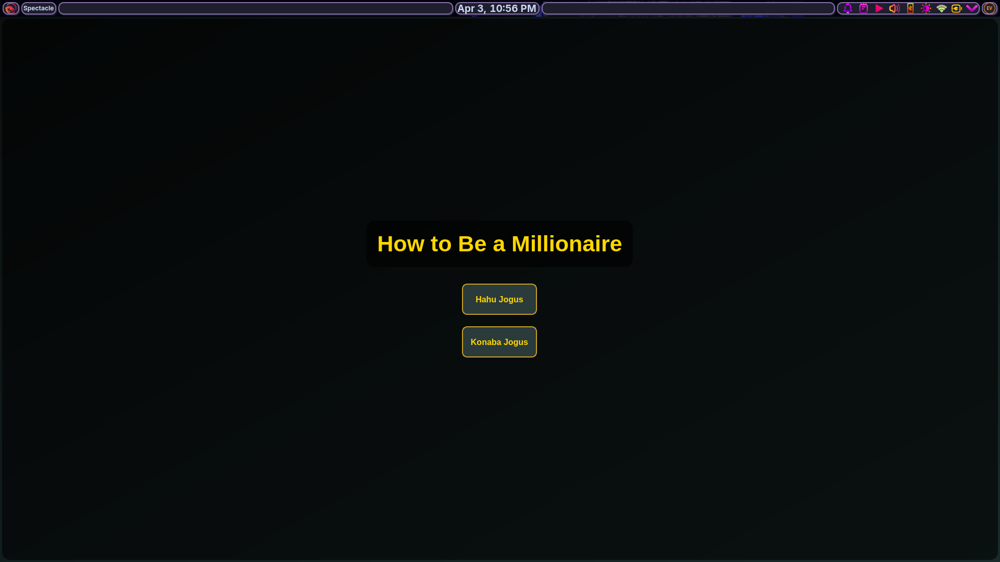
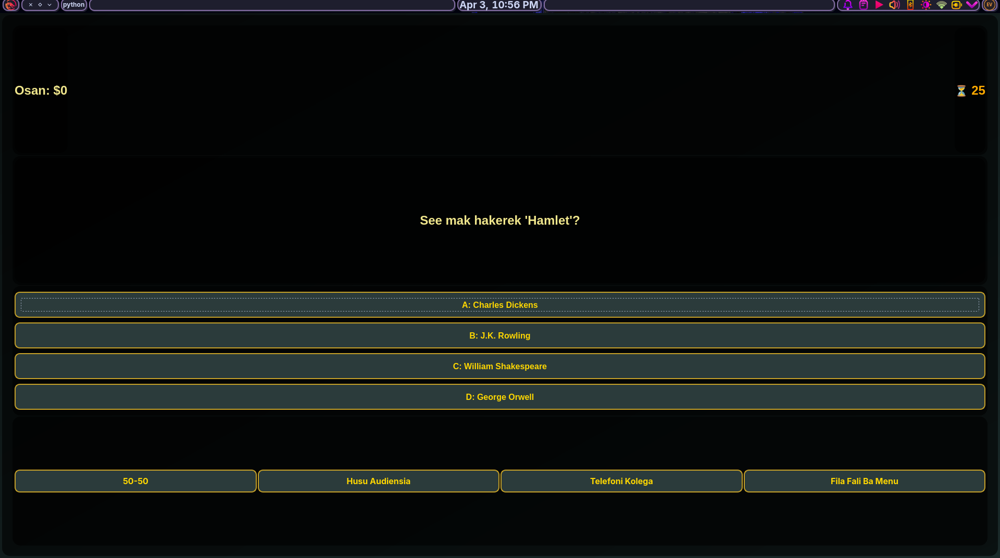

# 💰 Quiz Game: See Mak Sai Milionáriu?

*A high-stakes, interactive trivia application built with Python and PyQt6, featuring lifelines, difficulty scaling, and a localized Tetum interface.*

---

## 📖 Description
Inspired by the world-famous game show "Who Wants to Be a Millionaire", this application challenges users to answer 15 increasingly difficult questions to reach the $1,000,000 prize. 

The project demonstrates advanced **GUI development** using PyQt6, focusing on **event-driven programming** (Signals and Slots) and a clean separation between the game's visual interface and its underlying logic. All questions and feedback messages are written in **Tetum**.

## 🚀 Key Features
* **Progressive Difficulty:** Questions transition from Easy to Hard as the player advances.
* **Classic Lifelines (Ajuda):** Includes 50-50, Husu Audiensia, and Telefoni Kolega (each usable once).
* **Game Timer:** Integrated `QTimer` that gives players 30 seconds per question.
* **Dynamic Styling:** Uses a dark-mode "Fusion" style with gold accents for a premium game-show feel.

## 🖼️ Application Interface

To show you how the game looks, here are small screenshots of the main interface:

<p align="center">
  
  
</p>
<p align="center"><em>Figure 1: Visual layout of the question screen and options.</em></p>

## 🛠️ Tech Stack
* **Language:** Python 3.11+
* **Framework:** PyQt6
* **Architecture:** Modular Python (UI vs. Logic vs. Data)

## 📁 Repository Structure
* **`main_window.py`**: The **Entry Point** and UI Manager. Contains the `MainWindow` class and layouts.
* **`quiz_logic.py`**: The "Brain" of the game. Handles the timer, lifeline calculations, and score tracking.
* **`questions.py`**: The database containing the question sets and the money progression table ($100 to $1,000,000).

## ⚙️ Installation & Usage

### 1. Install Dependencies
You only need the PyQt6 library to run this game:
```bash
pip install PyQt6
